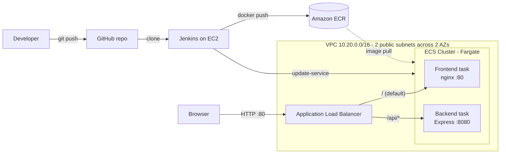

# TechPathway Tech Challenge 2 – Full-Stack Deployment with Jenkins, Docker & AWS

A React frontend and Express backend, containerized with Docker, deployed to **AWS ECS (Fargate)** behind an **Application Load Balancer**, with infrastructure built by **Terraform** and deployments automated by a **Jenkins** pipeline.

**Live app:** http://tc2-alb-385869850.us-east-1.elb.amazonaws.com
**Jenkins:** http://18.205.46.177:8080 (login details provided in the submission PDF)

---

## Architecture



The frontend and backend are served from **the same ALB address**. The React app calls relative paths (`/api/status`), and an ALB listener rule routes `/api/*` to the backend and everything else to the frontend. This means no backend URL is hardcoded into the frontend build, and the browser treats API calls as same-origin.

---

## Repository structure

```
├── backend/            Express API + Dockerfile
├── frontend/           React app + multi-stage Dockerfile (Node build → nginx)
├── terraform/          All AWS infrastructure for the app
└── Jenkinsfile         CI/CD pipeline definition
```

---

## Jenkins server – supporting AWS resources

Jenkins was set up manually (as permitted by the brief) and is kept separate from the Terraform-managed app infrastructure, so `terraform destroy` can never affect it.

| Resource           | Details                                                                                                                                                                                                             |
| ------------------ | ------------------------------------------------------------------------------------------------------------------------------------------------------------------------------------------------------------------- |
| **EC2 instance**   | `tc2-jenkins-server` – Ubuntu 24.04, t3.medium (4 GB RAM for Docker builds), 30 GB gp3 disk, in a public subnet of the default VPC                                                                                  |
| **Elastic IP**     | `18.205.46.177` – fixed public address so the Jenkins URL survives instance stop/start                                                                                                                              |
| **Security group** | `tc2-jenkins-sg` – port 8080 open publicly for the Jenkins UI; port 22 restricted to the administrator's IP                                                                                                         |
| **IAM role**       | `tc2-jenkins-role` – attached as an instance profile; grants ECR push/pull, ECS service updates and SSM access. **No AWS access keys are stored on the server** – the AWS CLI uses the role's temporary credentials |

Software installed on the instance: Jenkins LTS (Java 21), Docker (the `jenkins` user is in the `docker` group), AWS CLI v2, and Git.

---

## Infrastructure (Terraform)

All app infrastructure lives in `terraform/`, split by concern:

| File            | Creates                                                                                          |
| --------------- | ------------------------------------------------------------------------------------------------ |
| `provider.tf`   | AWS provider (us-east-1) with default tags on every resource                                     |
| `variables.tf`  | All configurable values (region, CIDRs, ports, task size)                                        |
| `networking.tf` | VPC, 2 public subnets across 2 AZs, internet gateway, route table                                |
| `security.tf`   | ALB security group (HTTP from internet); ECS task security group (traffic **only** from the ALB) |
| `alb.tf`        | ALB, frontend and backend target groups, listener, `/api/*` routing rule                         |
| `ecr.tf`        | ECR repositories with scan-on-push and a keep-last-10 lifecycle policy                           |
| `iam.tf`        | ECS task execution role (image pulls and CloudWatch logs)                                        |
| `ecs.tf`        | ECS cluster, log groups, task definitions and services                                           |
| `outputs.tf`    | App URL and the ECR/ECS names used by the pipeline                                               |

**Design decisions**

- **No NAT gateway.** Tasks run in public subnets with public IPs so they can pull from ECR directly. They're protected because their security group only accepts traffic from the ALB. A production setup would use private subnets and a NAT gateway; it was left out here to avoid its cost, as the brief doesn't require it.
- **Deployment circuit breaker with rollback.** If a new image fails its health checks, ECS automatically rolls back to the last working version.
- **Health checks** use the backend's dedicated `/api/health` endpoint and the frontend's `/`.

---

## CI/CD pipeline (Jenkins)

The `Jenkinsfile` runs these stages, with no manual steps once triggered:

1. **Checkout** – clones this repository
2. **Build images** – builds the frontend and backend Docker images
3. **Login to ECR** – authenticates using the EC2 instance's IAM role
4. **Push images** – pushes each image tagged with both the build number and `latest`
5. **Deploy to ECS** – forces a new deployment of both services so they pull the new `latest` images
6. **Verify deployment** – waits until ECS reports both services stable, so the pipeline only succeeds if the new version is actually running and healthy

A `post` step logs out of ECR and prunes old images to keep the Jenkins disk from filling up.

---

## How to deploy

**1. Build the infrastructure** (first time only)

```bash
cd terraform
terraform init
terraform apply -target=aws_ecr_repository.frontend -target=aws_ecr_repository.backend
# push an initial image to each ECR repo (see "Initial images" below), then:
terraform apply
```

The ECR repositories are created first so the ECS services have images to pull when they start.

**Initial images**

```bash
aws ecr get-login-password --region us-east-1 | docker login --username AWS --password-stdin <account-id>.dkr.ecr.us-east-1.amazonaws.com
docker build -t <ecr_frontend_url>:latest ./frontend && docker push <ecr_frontend_url>:latest
docker build -t <ecr_backend_url>:latest ./backend && docker push <ecr_backend_url>:latest
```

**2. Deploy changes** – push code to `main`, then in Jenkins open **tc2-pipeline** and click **Build Now**.

---

## How to test

1. Open the live app URL. The page should show **SUCCESS** and a GUID. A new GUID on each refresh confirms the frontend is reaching the backend through the ALB.
2. Check the backend directly: `curl http://tc2-alb-385869850.us-east-1.elb.amazonaws.com/api/health` returns `{"status":"ok"}`.
3. To test the pipeline, make a visible change (e.g. edit the heading in `frontend/src/App.js`), push to `main`, run **Build Now**, and refresh the app once the build succeeds.

---

## Running locally

**Backend**

```bash
cd backend
npm ci
npm start        # http://localhost:8080
```

**Frontend**

```bash
cd frontend
npm ci
npm start        # http://localhost:3000
```

---

## Cleanup

```bash
cd terraform
terraform destroy
```

Then manually terminate the Jenkins EC2 instance, release its Elastic IP, and delete `tc2-jenkins-sg` and `tc2-jenkins-role`.
